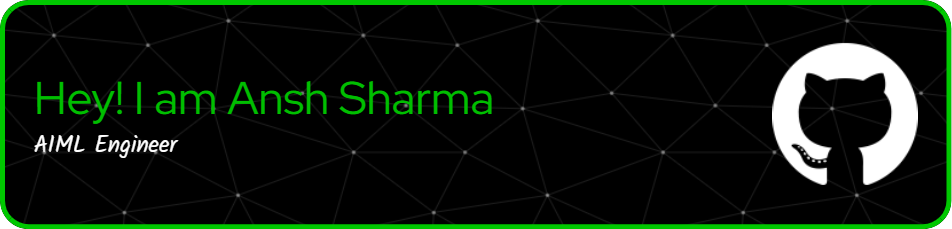

<!-- Banner -->

<h1 align="center">
    An Emgerging AI/ML Engineer from India 
    
</h1>

    

  

  

I am currently pursuing a B.Tech in Robotics and Automation from Symbiosis Institute of Technology, Pune. My passion lies in leveraging Artificial Intelligence and Machine Learning to solve complex, real-world problems. With a solid foundation in AI/ML, Deep Learning, and MLOps, I am dedicated to creating practical and impactful applications.

- 🔭 I’m currently working on **Multimodal AI for Emotion Detection**

- 🌱 I’m currently learning **MLOPs**

- 💬 Ask me about **ML, DL, NLP, Robotics**

- 📫 How to reach me **anshsharma11109@gmail.com**

- <h3 align="left">💼 Experience:</h3>
<h4 align = "Left"><b>AI/ML Intern | YoloBus.in - An EaseMyTrip.com Company (07/2024 - Present)</b></h4>
  - Developing a Dynamic Pricing Engine to predict bus ticket prices.
<h4 align = "Left">AI Research Intern | Symbiosis Centre for Applied Artificial Intelligence (06/2024 - Present)</b></h4>
  - AI Research Intern Under Dr. Shilpa Gite

<!-- Social Media -->
<h3 align="left">Connect with me:</h3>

<h3 align="center">Programming Languages</h3>

  <a href="#">
    
    
    
    
    
  </a>

<h3 align="center">Artificial Intelligence ,Machine Learning Tools and Data Science tools</h3>

  
  
   
<a href="https://pytorch.org/" target="_blank" rel="noreferrer">

  

  
</a>
  </a>

<h3 align="center">API Tools</h3>

  
  

<h3 align="center">Data Base Tools</h3>

 

<!-- Stats-->
<!-- 

 -->
<!-- Most Used Lang-->
<!-- 

 -->
<!-- Streak-->
<!-- 

 -->
 
<h2 align="left"> Github Stats </h2>

  

  

